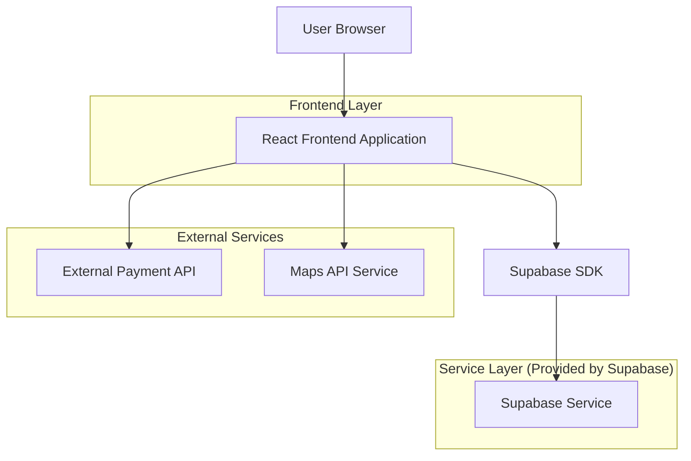
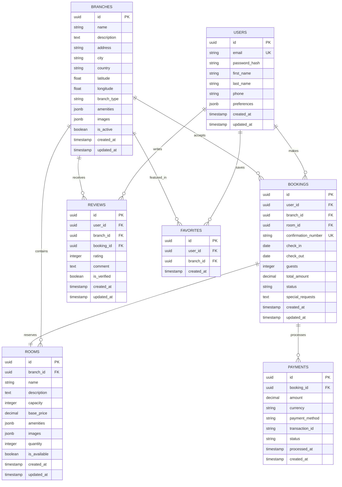

# Vinotel Hotel Booking System - Technical Architecture Document

## 1. Architecture Design



## 2. Technology Description

* Frontend: React\@18 + TypeScript\@5 + Tailwind CSS\@3 + Vite\@5

* Backend: Supabase (Authentication, Database, Storage)

* Icons: Lucide React\@0.400+

* State Management: React Context + useReducer

* Routing: React Router DOM\@6

* Form Handling: React Hook Form + Zod validation

* Date Handling: date-fns

* Image Optimization: Built-in React lazy loading

## 3. Route Definitions

| Route                    | Purpose                                                                              |
| ------------------------ | ------------------------------------------------------------------------------------ |
| /                        | Home page with hero section, location search widget, and featured Vinotel branches   |
| /branches                | Branch listings page with Vinotel branch listings, filters, and map view             |
| /branch/:id              | Branch details page with comprehensive Vinotel branch information and booking widget |
| /booking/:branchId       | Booking page with reservation form and payment processing                            |
| /confirmation/:bookingId | Booking confirmation page with reservation details                                   |
| /login                   | User authentication page with login form and social options                          |
| /register                | User registration page with account creation form                                    |
| /forgot-password         | Password recovery page with email verification                                       |
| /dashboard               | User dashboard with booking history and profile management                           |
| /dashboard/bookings      | Detailed booking history and management                                              |
| /dashboard/profile       | User profile settings and preferences                                                |
| /dashboard/favorites     | Saved Vinotel branches and wishlist management                                       |

## 4. API Definitions

### 4.1 Core API

**Branch Search**

```
GET /api/branches/search
```

Request:

| Param Name | Param Type | isRequired | Description                                    |
| ---------- | ---------- | ---------- | ---------------------------------------------- |
| location   | string     | true       | Search location (city, region, or branch name) |
| checkIn    | string     | true       | Check-in date in ISO format                    |
| checkOut   | string     | true       | Check-out date in ISO format                   |
| guests     | number     | true       | Number of guests                               |
| rooms      | number     | false      | Number of rooms (default: 1)                   |
| minPrice   | number     | false      | Minimum price filter                           |
| maxPrice   | number     | false      | Maximum price filter                           |
| amenities  | string\[]  | false      | Array of required amenities                    |
| branchType | string     | false      | Branch type filter (business, resort, city)    |

Response:

| Param Name | Param Type    | Description                        |
| ---------- | ------------- | ---------------------------------- |
| branches   | Branch\[]     | Array of matching Vinotel branches |
| totalCount | number        | Total number of results            |
| filters    | FilterOptions | Available filter options           |

**Branch Details**

```
GET /api/branches/:id
```

Response:

| Param Name | Param Type    | Description                         |
| ---------- | ------------- | ----------------------------------- |
| branch     | BranchDetails | Complete Vinotel branch information |
| rooms      | Room\[]       | Available room types                |
| amenities  | Amenity\[]    | Branch amenities list               |
| reviews    | Review\[]     | Guest reviews and ratings           |

**Create Booking**

```
POST /api/bookings
```

Request:

| Param Name      | Param Type   | isRequired | Description               |
| --------------- | ------------ | ---------- | ------------------------- |
| branchId        | string       | true       | Vinotel branch identifier |
| roomId          | string       | true       | Room type identifier      |
| checkIn         | string       | true       | Check-in date             |
| checkOut        | string       | true       | Check-out date            |
| guests          | GuestInfo\[] | true       | Guest information         |
| specialRequests | string       | false      | Special requests or notes |
| paymentMethod   | string       | true       | Payment method identifier |

Response:

| Param Name         | Param Type | Description                 |
| ------------------ | ---------- | --------------------------- |
| bookingId          | string     | Unique booking identifier   |
| status             | string     | Booking status              |
| totalAmount        | number     | Total booking cost          |
| confirmationNumber | string     | Booking confirmation number |

## 5. Data Model

### 5.1 Data Model Definition



### 5.2 Data Definition Language

**Users Table**

```sql
-- Create users table
CREATE TABLE users (
    id UUID PRIMARY KEY DEFAULT gen_random_uuid(),
    email VARCHAR(255) UNIQUE NOT NULL,
    password_hash VARCHAR(255) NOT NULL,
    first_name VARCHAR(100) NOT NULL,
    last_name VARCHAR(100) NOT NULL,
    phone VARCHAR(20),
    preferences JSONB DEFAULT '{}',
    created_at TIMESTAMP WITH TIME ZONE DEFAULT NOW(),
    updated_at TIMESTAMP WITH TIME ZONE DEFAULT NOW()
);

-- Enable RLS
ALTER TABLE users ENABLE ROW LEVEL SECURITY;

-- Create policies
CREATE POLICY "Users can view own profile" ON users
    FOR SELECT USING (auth.uid() = id);

CREATE POLICY "Users can update own profile" ON users
    FOR UPDATE USING (auth.uid() = id);

-- Grant permissions
GRANT SELECT ON users TO anon;
GRANT ALL PRIVILEGES ON users TO authenticated;
```

**Branches Table**

```sql
-- Create branches table
CREATE TABLE branches (
    id UUID PRIMARY KEY DEFAULT gen_random_uuid(),
    name VARCHAR(255) NOT NULL,
    description TEXT,
    address TEXT NOT NULL,
    city VARCHAR(100) NOT NULL,
    country VARCHAR(100) NOT NULL,
    latitude DECIMAL(10, 8),
    longitude DECIMAL(11, 8),
    branch_type VARCHAR(50) DEFAULT 'standard',
    amenities JSONB DEFAULT '[]',
    images JSONB DEFAULT '[]',
    is_active BOOLEAN DEFAULT true,
    created_at TIMESTAMP WITH TIME ZONE DEFAULT NOW(),
    updated_at TIMESTAMP WITH TIME ZONE DEFAULT NOW()
);

-- Create indexes
CREATE INDEX idx_branches_city ON branches(city);
CREATE INDEX idx_branches_type ON branches(branch_type);
CREATE INDEX idx_branches_location ON branches(latitude, longitude);

-- Enable RLS
ALTER TABLE branches ENABLE ROW LEVEL SECURITY;

-- Create policies
CREATE POLICY "Branches are viewable by everyone" ON branches
    FOR SELECT USING (is_active = true);

-- Grant permissions
GRANT SELECT ON branches TO anon;
GRANT ALL PRIVILEGES ON branches TO authenticated;
```

**Rooms Table**

```sql
-- Create rooms table
CREATE TABLE rooms (
    id UUID PRIMARY KEY DEFAULT gen_random_uuid(),
    branch_id UUID REFERENCES branches(id) ON DELETE CASCADE,
    name VARCHAR(255) NOT NULL,
    description TEXT,
    capacity INTEGER NOT NULL CHECK (capacity > 0),
    base_price DECIMAL(10, 2) NOT NULL CHECK (base_price > 0),
    amenities JSONB DEFAULT '[]',
    images JSONB DEFAULT '[]',
    quantity INTEGER NOT NULL DEFAULT 1,
    is_available BOOLEAN DEFAULT true,
    created_at TIMESTAMP WITH TIME ZONE DEFAULT NOW(),
    updated_at TIMESTAMP WITH TIME ZONE DEFAULT NOW()
);

-- Create indexes
CREATE INDEX idx_rooms_branch_id ON rooms(branch_id);
CREATE INDEX idx_rooms_price ON rooms(base_price);

-- Enable RLS
ALTER TABLE rooms ENABLE ROW LEVEL SECURITY;

-- Create policies
CREATE POLICY "Rooms are viewable by everyone" ON rooms
    FOR SELECT USING (is_available = true);

-- Grant permissions
GRANT SELECT ON rooms TO anon;
GRANT ALL PRIVILEGES ON rooms TO authenticated;
```

**Bookings Table**

```sql
-- Create bookings table
CREATE TABLE bookings (
    id UUID PRIMARY KEY DEFAULT gen_random_uuid(),
    user_id UUID REFERENCES auth.users(id) ON DELETE CASCADE,
    branch_id UUID REFERENCES branches(id) ON DELETE CASCADE,
    room_id UUID REFERENCES rooms(id) ON DELETE CASCADE,
    confirmation_number VARCHAR(20) UNIQUE NOT NULL,
    check_in DATE NOT NULL,
    check_out DATE NOT NULL,
    guests INTEGER NOT NULL CHECK (guests > 0),
    total_amount DECIMAL(10, 2) NOT NULL,
    status VARCHAR(20) DEFAULT 'pending' CHECK (status IN ('pending', 'confirmed', 'cancelled', 'completed')),
    special_requests TEXT,
    created_at TIMESTAMP WITH TIME ZONE DEFAULT NOW(),
    updated_at TIMESTAMP WITH TIME ZONE DEFAULT NOW(),
    CONSTRAINT valid_dates CHECK (check_out > check_in)
);

-- Create indexes
CREATE INDEX idx_bookings_user_id ON bookings(user_id);
CREATE INDEX idx_bookings_branch_id ON bookings(branch_id);
CREATE INDEX idx_bookings_dates ON bookings(check_in, check_out);
CREATE INDEX idx_bookings_status ON bookings(status);

-- Enable RLS
ALTER TABLE bookings ENABLE ROW LEVEL SECURITY;

-- Create policies
CREATE POLICY "Users can view own bookings" ON bookings
    FOR SELECT USING (auth.uid() = user_id);

CREATE POLICY "Users can create own bookings" ON bookings
    FOR INSERT WITH CHECK (auth.uid() = user_id);

-- Grant permissions
GRANT ALL PRIVILEGES ON bookings TO authenticated;
```

**Initial Data**

```sql
-- Insert sample branches
INSERT INTO branches (name, description, address, city, country, latitude, longitude, branch_type, amenities, images) VALUES
('Vinotel Grand Palace', 'Luxury branch in the heart of the city with world-class amenities and exceptional service.', '123 Grand Avenue', 'New York', 'USA', 40.7589, -73.9851, 'luxury', '["WiFi", "Pool", "Spa", "Gym", "Restaurant", "Bar", "Concierge"]', '["https://images.unsplash.com/photo-1566073771259-6a8506099945"]'),
('Vinotel Seaside Resort', 'Beachfront resort branch with stunning ocean views and premium facilities.', '456 Ocean Drive', 'Miami', 'USA', 25.7617, -80.1918, 'resort', '["WiFi", "Beach Access", "Pool", "Restaurant", "Water Sports"]', '["https://images.unsplash.com/photo-1571003123894-1f0594d2b5d9"]'),
('Vinotel Business Center', 'Modern business branch with state-of-the-art conference facilities.', '789 Business Blvd', 'San Francisco', 'USA', 37.7749, -122.4194, 'business', '["WiFi", "Business Center", "Gym", "Restaurant", "Meeting Rooms"]', '["https://images.unsplash.com/photo-1564501049412-61c2a3083791"]');

-- Insert sample rooms
INSERT INTO rooms (branch_id, name, description, capacity, base_price, amenities, images, quantity) 
SELECT 
    b.id,
    'Deluxe Suite',
    'Spacious suite with premium amenities and city views.',
    2,
    299.99,
    '["King Bed", "City View", "Mini Bar", "Work Desk", "Premium WiFi"]',
    '["https://images.unsplash.com/photo-1631049307264-da0ec9d70304"]',
    5
FROM branches b WHERE b.name = 'Vinotel Grand Palace';
```

