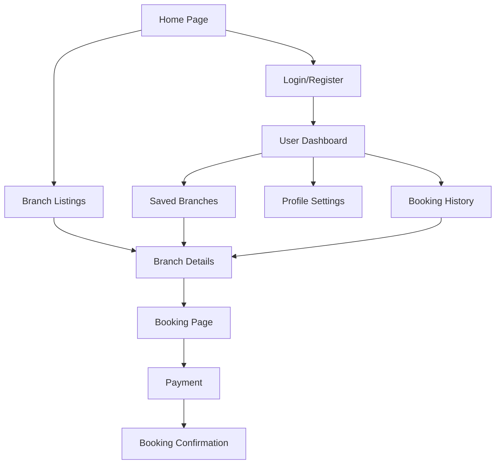

# Vinotel Hotel Booking System - Product Requirements Document

## 1. Product Overview
Vinotel Hotel Booking System is a modern, responsive web application designed for the Vinotel hotel brand to manage bookings across multiple branch locations with an elegant and intuitive user experience.

The system addresses the need for a centralized booking platform for Vinotel's multiple hotel branches, targeting both leisure and business travelers who seek a consistent, hassle-free reservation experience across all Vinotel locations. The platform provides comprehensive information about all Vinotel properties, real-time availability across branches, and secure booking management to maximize guest satisfaction and brand loyalty.

## 2. Core Features

### 2.1 User Roles
| Role | Registration Method | Core Permissions |
|------|---------------------|------------------|
| Guest User | No registration required | Can search Vinotel locations, view branch details, and browse without booking |
| Registered User | Email registration with verification | Can book rooms across all Vinotel branches, manage reservations, save favorite locations, and access booking history |
| Branch Manager | Admin invitation with verification | Can manage specific branch listings, room inventory, pricing, and view branch analytics |
| Regional Manager | Admin invitation with verification | Can oversee multiple branches, view consolidated reports, and manage regional operations |
| Corporate Admin | Admin invitation with verification | Can manage all Vinotel branches, corporate settings, and access system-wide analytics |

### 2.2 Feature Module
Our Vinotel hotel booking system consists of the following main pages:
1. **Home page**: hero section with location search widget, featured Vinotel branches showcase, destination highlights, and guest testimonials.
2. **Branch listings page**: Vinotel branch listings with filters, map view, sorting options, and pagination.
3. **Branch details page**: comprehensive Vinotel branch information, room types, amenities, photos gallery, reviews, and booking widget.
4. **Booking page**: reservation form, guest details, payment processing, and booking confirmation.
5. **User dashboard**: booking history across all branches, profile management, saved Vinotel locations, and account settings.
6. **Authentication pages**: login, registration, and password recovery forms.

### 2.3 Page Details
| Page Name | Module Name | Feature description |
|-----------|-------------|---------------------|
| Home page | Hero Section | Display prominent search widget with destination, check-in/out dates, guest selection, and call-to-action button |
| Home page | Featured Branches | Showcase top-rated Vinotel branches with images, ratings, pricing, and quick booking options |
| Home page | Destination Highlights | Present popular destinations with attractive visuals and promotional offers |
| Home page | Testimonials | Display customer reviews and ratings to build trust and credibility |
| Branch Listings | Branch Cards | Show Vinotel branch cards with images, ratings, amenities, pricing, and availability status |
| Search Results | Filter Panel | Provide filters for price range, star rating, amenities, location, and guest ratings |
| Branch Listings | Map Integration | Display Vinotel branches on interactive map with location markers and proximity information |
| Search Results | Sorting Options | Enable sorting by price, rating, distance, and popularity |
| Branch Details | Branch Information | Present comprehensive Vinotel branch details including description, amenities, policies, and contact information |
| Hotel Details | Room Types | Display available room categories with images, descriptions, capacity, and pricing |
| Hotel Details | Photo Gallery | Showcase high-quality hotel and room images with lightbox functionality |
| Hotel Details | Reviews Section | Show guest reviews with ratings, comments, and review filtering options |
| Hotel Details | Booking Widget | Provide date selection, room selection, guest details, and price calculation |
| Booking Page | Reservation Form | Collect guest information, special requests, and booking preferences |
| Booking Page | Payment Processing | Secure payment gateway integration with multiple payment methods |
| Booking Page | Booking Confirmation | Display booking summary, confirmation details, and email notification |
| User Dashboard | Booking History | List past and upcoming reservations with status, details, and management options |
| User Dashboard | Profile Management | Allow users to update personal information, preferences, and notification settings |
| User Dashboard | Saved Branches | Display favorited Vinotel branches with quick booking and comparison features |
| Authentication | Login Form | Secure user authentication with email/password and social login options |
| Authentication | Registration Form | User account creation with email verification and terms acceptance |
| Authentication | Password Recovery | Password reset functionality with email verification and security questions |

## 3. Core Process

**Guest User Flow:**
Guest users can browse the homepage, search for Vinotel branch locations, view branch listings, and explore individual branch details. To complete a booking, they must register or login to access the booking functionality.

**Registered User Flow:**
Registered users can perform all guest actions plus complete bookings across any Vinotel branch, manage reservations, save favorite branch locations, and access their consolidated booking history through the user dashboard.

**Branch Manager Flow:**
Branch managers can login to access their branch management dashboard, update their specific branch information, manage room inventory and pricing, and view branch-specific booking analytics and reports.

**Regional/Corporate Manager Flow:**
Regional and corporate managers can access consolidated dashboards to oversee multiple branches, view system-wide analytics, manage corporate policies, and coordinate operations across the Vinotel brand.

## 4. User Interface Design

### 4.1 Design Style
- **Primary Colors**: Deep teal (#0f766e) and warm gold (#f59e0b) reflecting luxury and trust
- **Secondary Colors**: Soft gray (#f8fafc) for backgrounds and charcoal (#374151) for text
- **Button Style**: Rounded corners with subtle shadows and hover animations for modern appeal
- **Typography**: Inter font family with 16px base size for readability across devices
- **Layout Style**: Card-based design with generous white space and clean grid layouts
- **Icons**: Lucide React icons with consistent 24px size and primary color theming

### 4.2 Page Design Overview
| Page Name | Module Name | UI Elements |
|-----------|-------------|-------------|
| Home page | Hero Section | Full-width background image with overlay, centered search widget with rounded inputs, prominent CTA button with gradient background |
| Home page | Featured Branches | Grid layout with Vinotel branch cards featuring high-quality images, consistent brand styling, price badges, and hover animations |
| Branch Listings | Branch Cards | List/grid toggle view, Vinotel branch cards with left-aligned images, right-aligned pricing, and quick action buttons |
| Search Results | Filter Panel | Collapsible sidebar with grouped filters, range sliders for pricing, checkbox amenities, and clear filter options |
| Branch Details | Photo Gallery | Masonry layout with primary hero image and thumbnail grid, lightbox modal with navigation controls |
| Branch Details | Booking Widget | Sticky sidebar widget with date pickers, dropdown selectors, price breakdown, and prominent booking button |
| Booking Page | Payment Form | Step-by-step wizard with progress indicator, secure form fields, payment method icons, and SSL security badges |
| User Dashboard | Navigation | Sidebar navigation with user avatar, menu items with icons, and active state highlighting |

### 4.3 Responsiveness
The application follows a mobile-first approach with responsive breakpoints at 640px (mobile), 768px (tablet), and 1024px (desktop). Touch-optimized interactions include larger tap targets, swipe gestures for image galleries, and optimized form inputs for mobile keyboards. The design ensures consistent user experience across all device sizes with adaptive layouts and scalable typography.